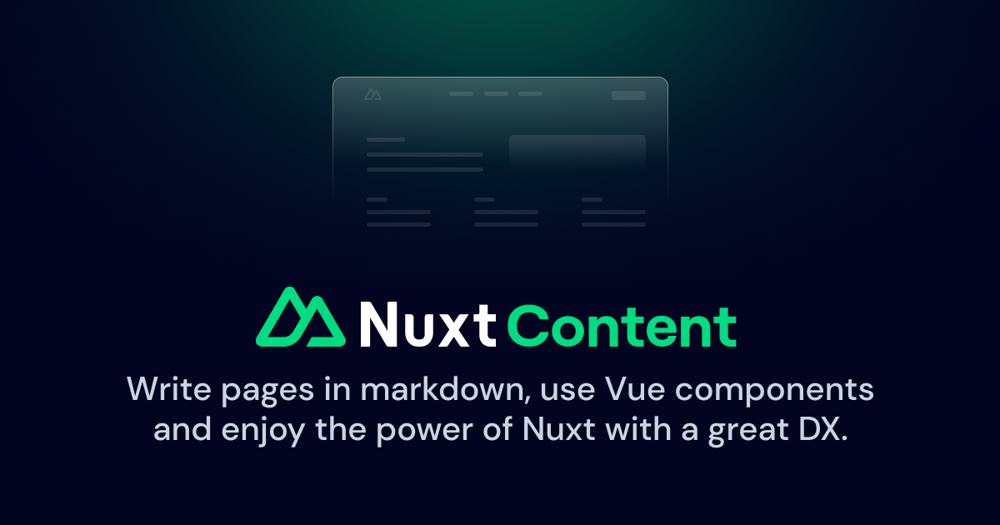

# Nuxt Content

[![npm version][npm-version-src]][npm-version-href]
[![npm downloads][npm-downloads-src]][npm-downloads-href]
[![License][license-src]][license-href]
[![Nuxt][nuxt-src]][nuxt-href]
[![Volta][volta-src]][volta-href]

Nuxt Content reads the `content/` directory in your project, parses `.md`, `.yml`, `.csv` or `.json` files and creates a powerful data layer for your application. Bonus, use Vue components in Markdown with the [MDC syntax](https://content.nuxt.com/docs/files/markdown).

- [📖 &nbsp;Read the documentation](https://content.nuxt.com)
- [✨ &nbsp;Intro video](https://www.youtube.com/watch?v=o9e12WbKrd8)
- [✍️ &nbsp;Nuxt Studio](https://content.nuxt.com/studio)

## Features

- [**Nuxt 3**](https://nuxt.com) support
- Work in serverless and edge environments (Cloudflare Workers, etc.)
- Render Vue components in Markdown with the [MDC syntax](https://content.nuxt.com/docs/files/markdown)
- Fully typed collections and queries
- Navigation generation
- Blazing fast hot module replacement in development
- Code highlighting with [**Shiki**](https://github.com/shikijs/shiki)
- Powerful query builder on top of SQLite database
- [... and more](https://content.nuxt.com)

## 💻 Development

- Clone repository
- Install dependencies using `pnpm install`
- Prepare using `pnpm dev:prepare`
- Build using `pnpm prepack`
- Try playground using `pnpm dev`
- Test using `pnpm test`

## License

[MIT](./LICENSE) - Made with 💚

[npm-version-src]: https://img.shields.io/npm/v/@nuxt/content/latest.svg?style=flat&colorA=18181B&colorB=28CF8D
[npm-version-href]: https://npmjs.com/package/@nuxt/content

[npm-downloads-src]: https://img.shields.io/npm/dm/@nuxt/content.svg?style=flat&colorA=18181B&colorB=28CF8D
[npm-downloads-href]: https://npm.chart.dev/@nuxt/content

[license-src]: https://img.shields.io/github/license/nuxt/content.svg?style=flat&colorA=18181B&colorB=28CF8D
[license-href]: https://github.com/nuxt/content/blob/main/LICENSE

[nuxt-src]: https://img.shields.io/badge/Nuxt-18181B?logo=nuxt.js
[nuxt-href]: https://nuxt.com

[volta-src]: https://user-images.githubusercontent.com/904724/209143798-32345f6c-3cf8-4e06-9659-f4ace4a6acde.svg
[volta-href]: https://volta.net/nuxt/content?utm_source=readme_nuxt_content
