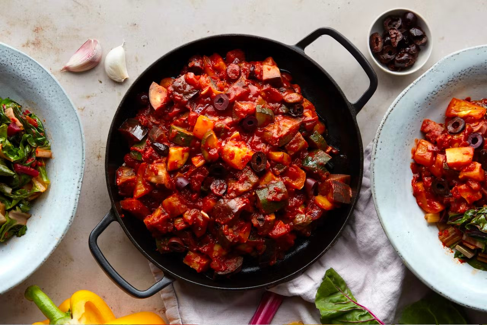
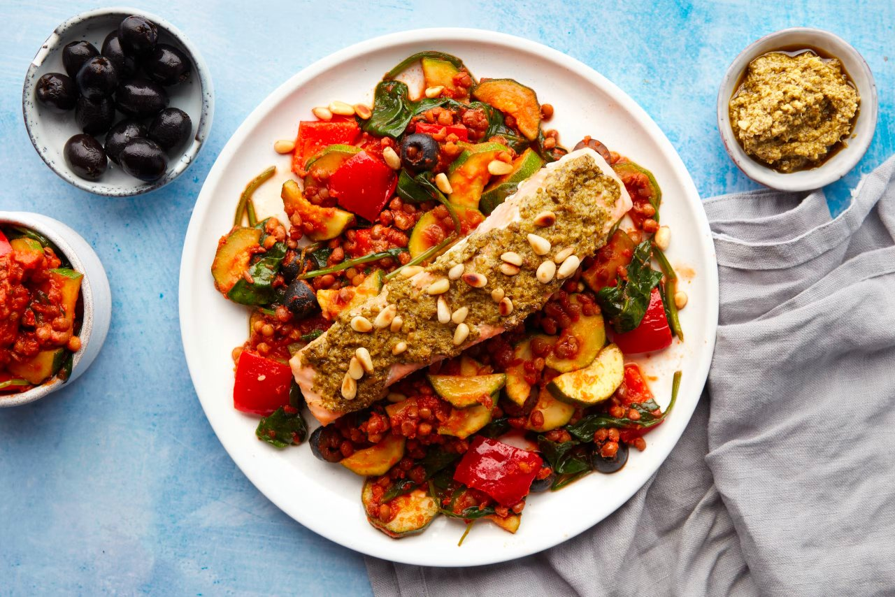

# Co-located assets

Reference assets sitting next to this file with **relative paths**. At build time
they are copied next to the site and every reference (markdown, MDC components,
raw HTML and frontmatter) is rewritten to an absolute URL.

## Path resolution

Same folder:



Sub folder:



Parent folder:


Absolute path (the asset is served at its de-ordered location):


## Media & files

Links to an asset open in a new tab:

- [Download the PDF](files/sample.pdf)

Video, with a co-located poster image:

<video
  src="media/sample.mp4"
  poster="media/turkey-casserole.jpg"
  controls
  width="480"
></video>

Iframe to a local HTML file:

<iframe
  src="media/sample.html"
  width="100%"
  height="200"
></iframe>

Embed a PDF:

<embed
  src="files/sample.pdf"
  width="100%"
  height="300"
>

## Frontmatter

A single value bound to a component (`:src="featured"`):

:img{:src="featured" alt="From frontmatter"}

An array bound to a custom component (a gallery built from `gallery`):

:content-gallery{:items="gallery"}

## Image sizing

By default an `aspect-ratio` is injected so images reserve their space before
loading — no layout shift, no configuration:


Switch to `width`/`height` attributes with `imageSize: 'attrs'`, encode the size
in a `?width=&height=` query with `'src'`, or turn it off with `imageSize: ''`.

## AST traversal

Existing attributes are preserved and merged (`width`, `style`):

:img{src="media/turkey-casserole.jpg" width="240" style="transform: rotate(-3deg);" alt="Rotated casserole"}

Paths inside fenced code are never rewritten:

```ts
const src = 'media/turkey-casserole.jpg'
```

Components inside tables are processed too:

| Label  | Image                                                              |
| ------ | ------------------------------------------------------------------ |
| Recipe | :img{src="italian-bean-stew.jpg" style="width: 80px;" alt="Stew"} |

## Ordering

This page lives in `1.real-content/`, yet its assets are served without the
numbering prefix: `media/pesto-salmon-lentils.jpg` is served at
`/real-content/media/pesto-salmon-lentils.jpg`.

## Nuxt Image

Assets are served from the site root, so with `@nuxt/image` installed
`:nuxt-img{src="media/turkey-casserole.jpg"}` resolves them through the default
IPX provider.
